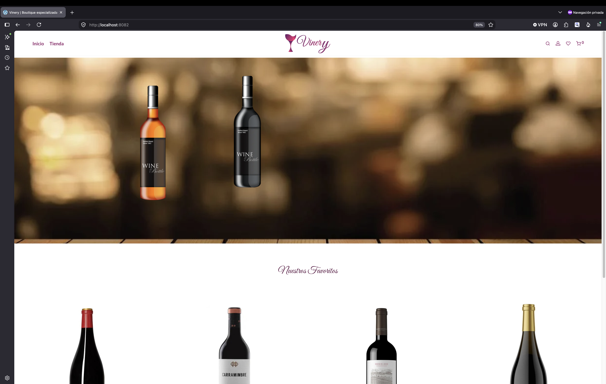
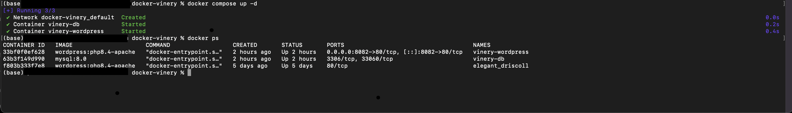
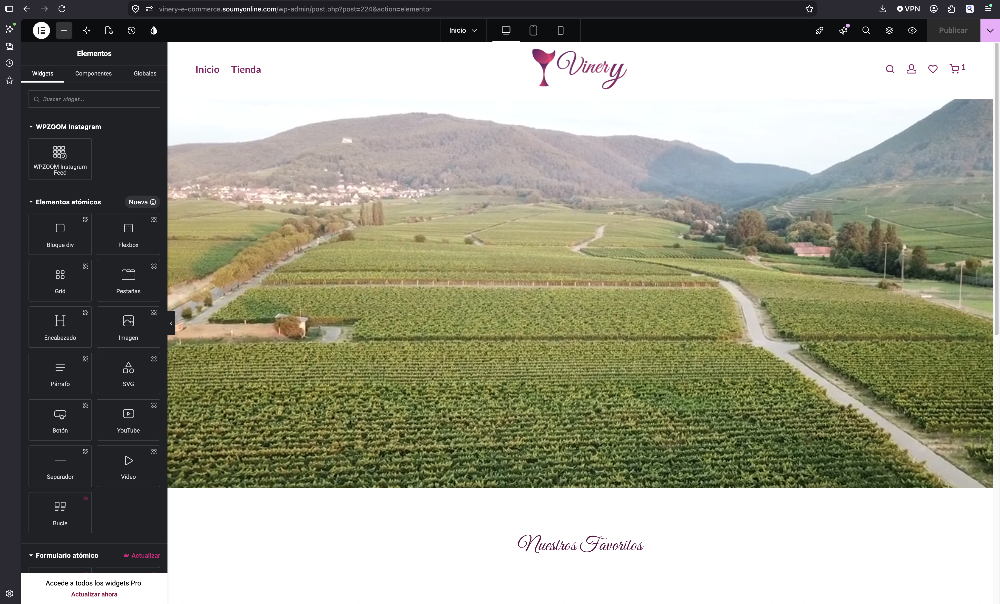
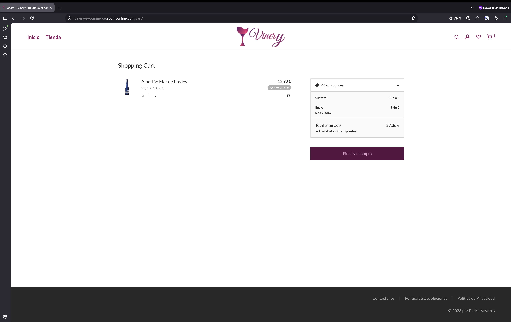
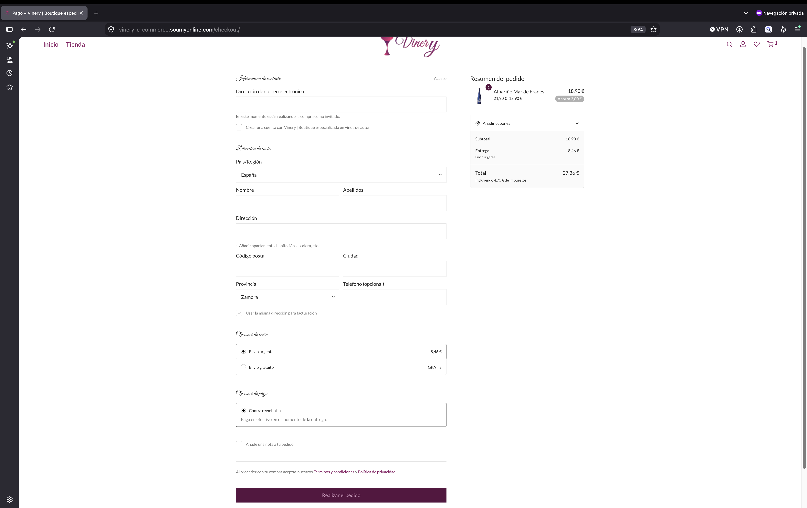
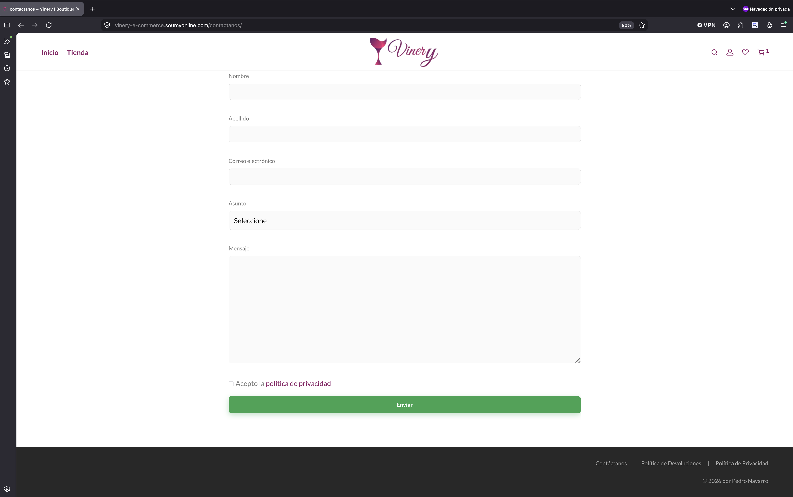
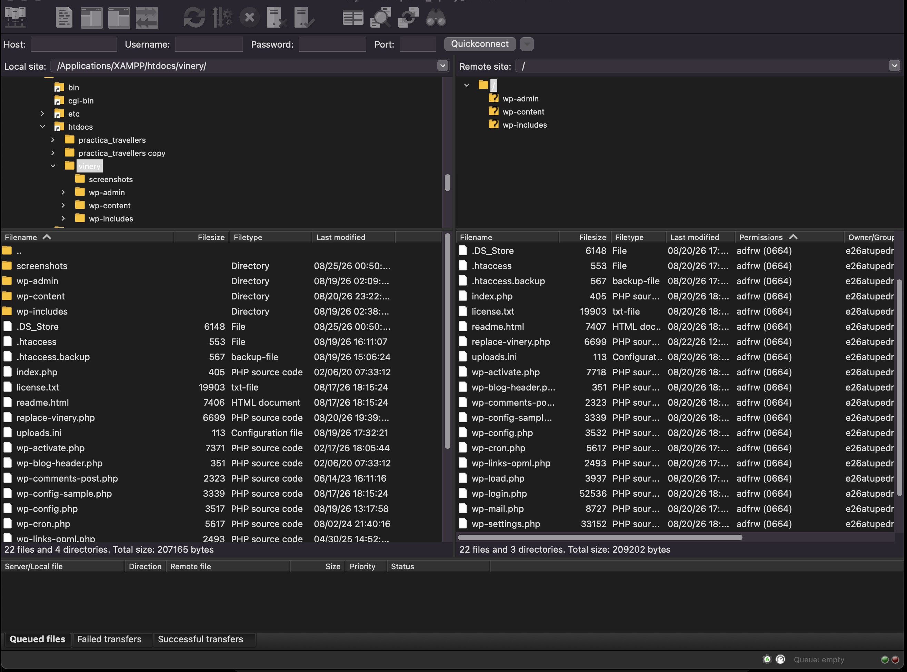
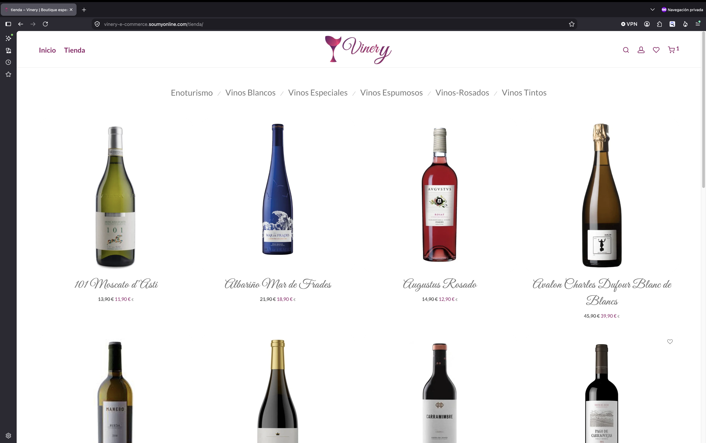
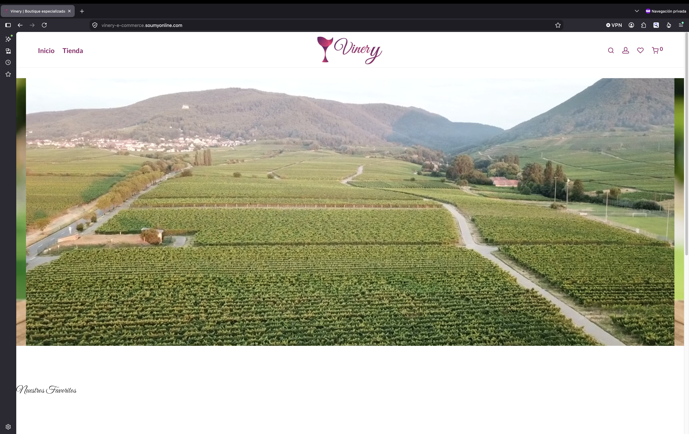

# Vinery – Wine E-commerce Website

## Project Overview

Vinery is a wine e-commerce website developed as part of an academic web development project and subsequently extended and completed independently.

The website was developed with WordPress and WooCommerce, using the complete Savoy theme as the foundation. Additional customization was implemented using Elementor and custom CSS to achieve visual and functional requirements that were not available directly through the theme's configuration options.

The project also involved configuring a Docker-based local development environment, troubleshooting WordPress migration issues, configuring email functionality, and deploying the completed website to a live server.

---

## Project Highlights

- WordPress e-commerce development
- WooCommerce implementation
- Savoy theme customization
- Elementor page development
- Custom CSS
- Shopping cart and checkout
- Cash on delivery payment method
- Contact form and email configuration
- Order status email notifications
- Docker-based local development
- PHP 8.4, Apache and MySQL
- Git and GitHub version control
- FTP deployment using FileZilla
- WordPress migration between environments
- Troubleshooting of WordPress URL and permalink issues

---

## Features

- Wine product catalogue
- Product pages
- Shopping cart
- Checkout process
- Cash on delivery payment method
- Contact form
- Email notifications
- Order status emails
- Image/video slider
- Responsive layout
- Custom typography
- Custom colour palette
- Customized image presentation
- Spanish-language content
- Live deployment

---

## Technologies & Tools

### Core Technologies

- WordPress
- PHP 8.4
- Apache
- MySQL
- Docker
- Git
- GitHub

### WordPress Theme

- Savoy

### WordPress Plugins

- WooCommerce
- Elementor
- Slider Revolution
- WP Mail SMTP
- Contact Form 7
- reSmush.it Image Optimizer

### Front-End

- HTML
- CSS
- Custom CSS

### Deployment

- FileZilla
- Web hosting environment
- WordPress database migration

---

## Development Environment

The project was developed locally using a Docker-based environment.

The Docker environment was created by adapting the development setup previously established for another WordPress project, allowing the same general architecture to be reused instead of configuring the complete environment from scratch.

The Vinery project was located inside the XAMPP web directory:

    XAMPP/xamppfiles/htdocs/vinery/

The Docker configuration was maintained separately:

    ~/docker-vinery/
    └── docker-compose.yml

The final local environment consisted of:

- WordPress
- PHP 8.4
- Apache
- MySQL

Vinery was configured to run locally using port `8082`.

---

## Docker

Docker was used to provide a consistent local WordPress development environment.

The environment was adapted from the existing Docker configuration used for the Travellers project and configured specifically for Vinery.

The separation between the WordPress project and the Docker configuration was maintained as follows:

    WordPress project
    └── XAMPP/xamppfiles/htdocs/vinery/

    Docker configuration
    └── ~/docker-vinery/docker-compose.yml

This approach allowed the same development architecture to be reused while maintaining an independent environment for the Vinery project.

---

## WordPress & Savoy

The website uses the complete **Savoy** WordPress theme as its foundation.

The theme provided the main structure and functionality of the website, while additional customization was implemented where the built-in theme options were not sufficient for the desired result.

Custom CSS was used to extend the theme's visual customization capabilities without modifying the theme's core files.

The main customizations included:

- Font sizes
- Typography
- Colour palette
- Image styling
- Border radius
- Additional visual adjustments
- Layout refinements

---

## Elementor

Elementor was used to build and customize the website's visual sections.

Elementor was selected based on previous experience using it to develop another WordPress project.

The combination of the Savoy theme, Elementor and custom CSS allowed the website to be adapted beyond the theme's default configuration options.

---

## WooCommerce

WooCommerce was used to transform the WordPress installation into an e-commerce website.

The implementation included:

- Product catalogue
- Product pages
- Shopping cart
- Checkout
- Order management
- Customer information
- Order status notifications

For demonstration purposes, the checkout was configured with **cash on delivery** rather than integrating a paid online payment gateway.

This allowed the complete purchasing workflow to be tested without requiring a commercial payment gateway.

---

## Slider Revolution

**Slider Revolution** was used to create the main visual slider on the homepage.

The slider was integrated into the website's design to provide a prominent visual presentation of the products and content.

---

## Contact Form & Email Configuration

A contact form was implemented using **Contact Form 7**.

The form was integrated into the website footer and customized using additional CSS.

**WP Mail SMTP** was configured to handle email delivery.

Email functionality was also configured for WooCommerce so that order status notifications could be sent during the purchasing workflow.

---

## Content & Visual Customization

The website content was manually adapted to Spanish to maintain consistency throughout the project.

Visual customization included:

- Typography adjustments
- Font size adjustments
- Colour customization
- Image styling
- Rounded image corners
- Footer customization
- Custom HTML in the footer
- Additional CSS

The footer was customized using HTML and CSS to integrate additional information and the contact form into the overall website design.

---

## Image Optimization

**reSmush.it Image Optimizer** was used to optimize images and reduce their file size while maintaining appropriate visual quality.

Image optimization was considered part of the website's performance and content management workflow.

---

## Development Workflow

The project followed the following development and deployment workflow:

    Local WordPress Development
                ↓
             Docker
                ↓
    WordPress + PHP 8.4 + Apache + MySQL
                ↓
       Local development on port 8082
                ↓
          Git Repository
                ↓
             GitHub
                ↓
           FileZilla
                ↓
        Test Server / Domain
                ↓
     Configuration & Migration
                ↓
        Live Vinery Website

---

## Version Control

Git was introduced to manage the project source files and provide version control.

The project is maintained in a Git repository and will be published through GitHub as part of the development portfolio.

Sensitive WordPress configuration files such as `wp-config.php` are excluded from version control using `.gitignore`.

---

## Deployment

After completing the local development process, the WordPress installation was transferred to the server using **FileZilla**.

The deployment process involved transferring the WordPress files to the hosting environment and configuring the required WordPress settings.

---

## WordPress Migration

The project required the WordPress installation to be migrated from the local Docker environment to the server.

One of the technical challenges involved updating WordPress URLs contained within the database.

Because WordPress stores some information as serialized data, URL replacement cannot always be performed safely using a simple text replacement.

A dedicated replacement process was used to update the URLs in the database.

After completing the replacement, the WordPress permalink settings were saved again to ensure that the site's URL structure and rewrite rules were correctly regenerated.

The migration was then tested to verify that the website and WordPress administration area were working correctly.

---

## Challenges & Solutions

### Docker Environment Configuration

**Challenge**

The initial Docker setup involved clarifying the relationship between the local WordPress directory and the Docker configuration directory.

**Solution**

The project structure was clearly separated into the WordPress project directory and the Docker configuration directory, allowing the containers to be configured correctly.

---

### WordPress URL Migration

**Challenge**

Migrating WordPress from the local environment to the server required updating URLs stored in the database, including serialized WordPress data.

**Solution**

A URL replacement script was used to update the relevant database references. After completing the migration, the WordPress permalink settings were saved again to regenerate the correct rewrite rules.

---

### Theme Customization

**Challenge**

Some visual requirements could not be achieved using the configuration options provided by the Savoy theme.

**Solution**

Additional CSS was implemented to extend the theme's styling capabilities without modifying the theme's core files.

---

### Payment Gateway

**Challenge**

The project required a complete e-commerce purchasing workflow, but integrating a commercial online payment gateway was unnecessary for the academic project.

**Solution**

WooCommerce was configured using cash on delivery, allowing the complete cart and checkout workflow to be implemented and tested without requiring a paid payment gateway.

---

## Screenshots

### Homepage

### Product Page

### Shopping Cart

### Checkout

### Contact Form

### Elementor

### Docker

### FileZilla

### Live Deployment

---

## Live Demo

**[Visit the Vinery website](https://vinery-e-commerce.soumyonline.com/)**

---

## What I Learned

This project provided practical experience developing and deploying a WordPress e-commerce website.

Key areas of learning included:

- WordPress development
- WooCommerce configuration
- E-commerce workflows
- Elementor
- Theme customization
- Custom CSS
- Contact form configuration
- SMTP email configuration
- WooCommerce order notifications
- Docker-based development
- PHP, Apache and MySQL environments
- Git and GitHub
- FTP deployment
- WordPress migration
- Database URL replacement
- Troubleshooting permalink and migration issues

---

## Future Improvements

Possible future improvements include:

- Integration of a production payment gateway
- Further performance optimization
- Additional accessibility improvements
- Advanced WooCommerce configuration
- Further responsive design refinements
- SEO optimization
- Additional product and catalogue functionality